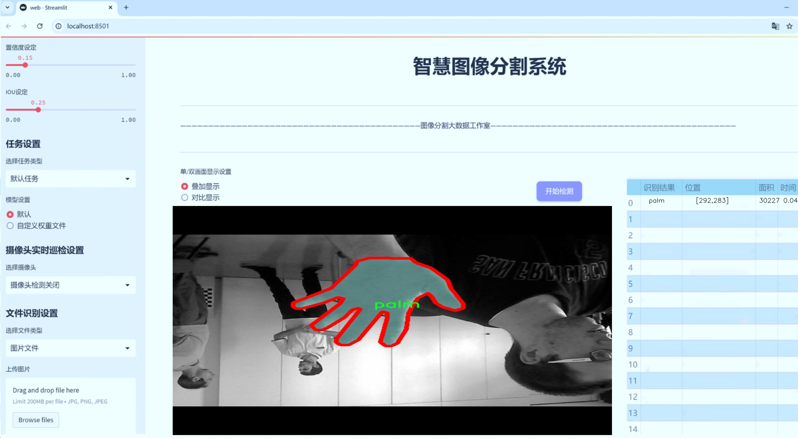
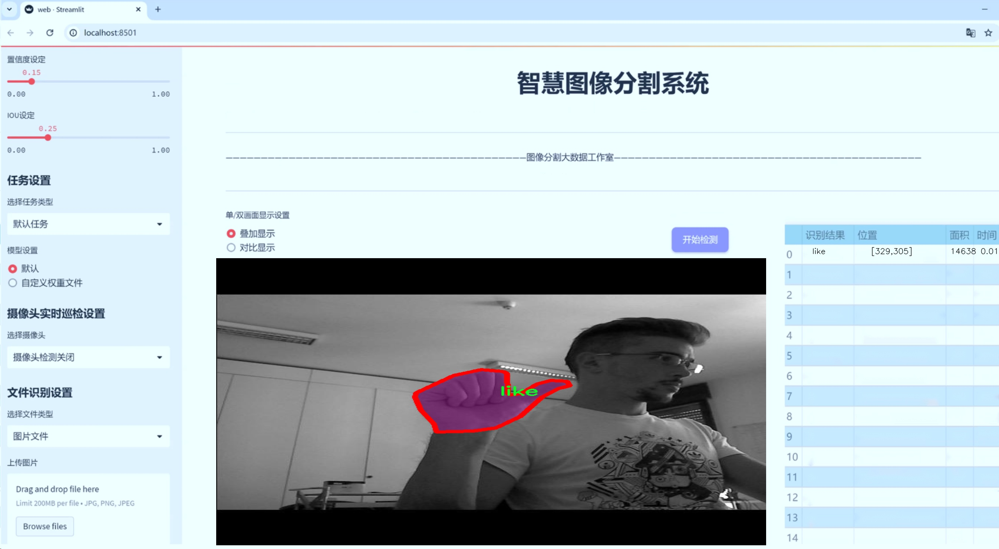
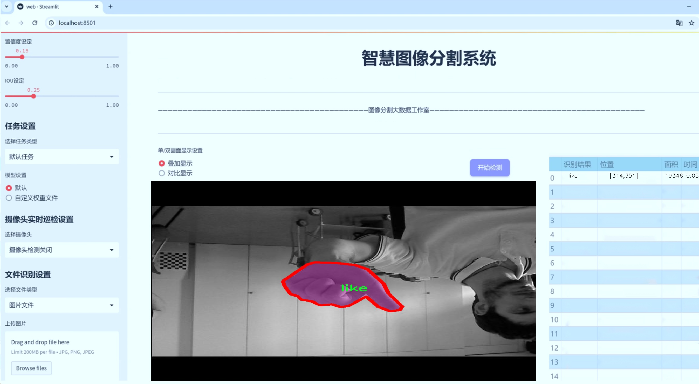
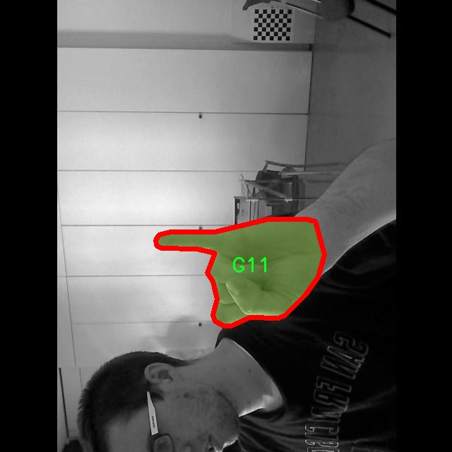
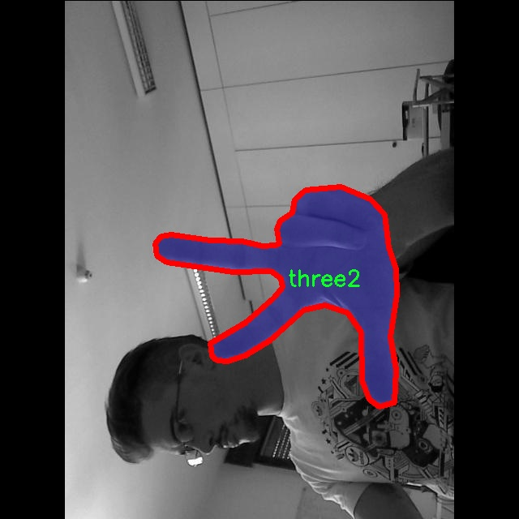
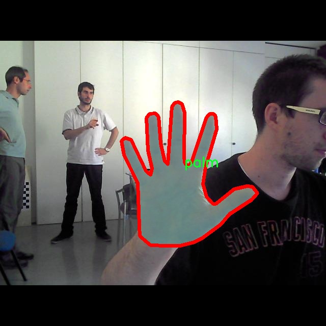
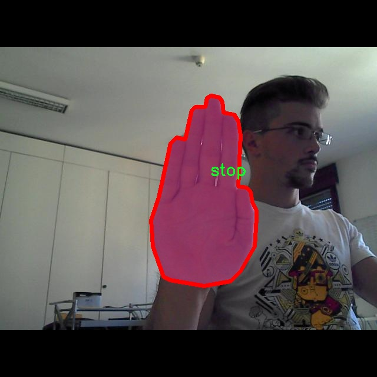
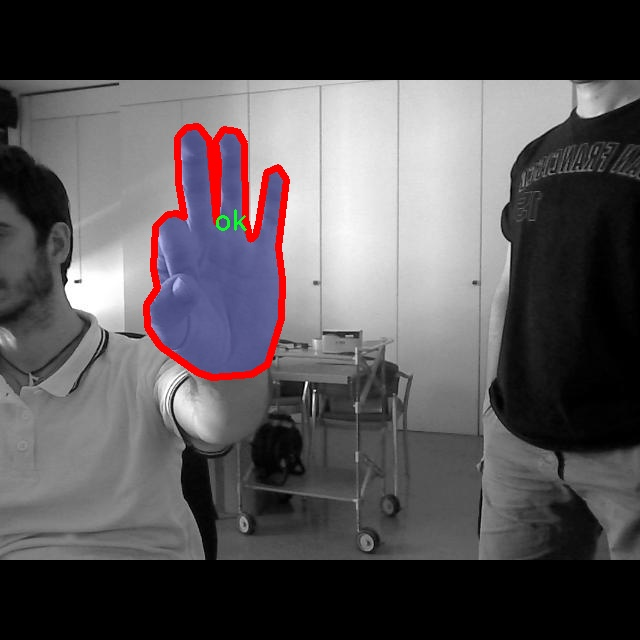

# 手势分割系统源码＆数据集分享
 [yolov8-seg-C2f-ODConv＆yolov8-seg-C2f-DCNV3等50+全套改进创新点发刊_一键训练教程_Web前端展示]

### 1.研究背景与意义

项目参考[ILSVRC ImageNet Large Scale Visual Recognition Challenge](https://gitee.com/YOLOv8_YOLOv11_Segmentation_Studio/projects)

项目来源[AAAI Global Al lnnovation Contest](https://kdocs.cn/l/cszuIiCKVNis)

研究背景与意义

随着人工智能技术的迅猛发展，手势识别作为人机交互的重要方式，受到了广泛关注。手势不仅是人类交流的基本形式之一，更是信息传递和情感表达的重要载体。在虚拟现实、增强现实以及智能家居等领域，手势识别技术的应用前景广阔。尤其是在疫情后，非接触式交互方式的需求激增，使得手势识别技术的研究显得尤为重要。传统的手势识别方法多依赖于复杂的特征提取和分类算法，往往难以满足实时性和准确性的双重要求。因此，基于深度学习的手势分割系统逐渐成为研究的热点。

本研究旨在基于改进的YOLOv8模型，构建一个高效的手势分割系统。YOLO（You Only Look Once）系列模型因其快速的检测速度和较高的准确率，已成为目标检测领域的佼佼者。YOLOv8作为该系列的最新版本，进一步优化了模型结构和算法性能，能够在保持高精度的同时，实现实时处理。这一特性使得YOLOv8在手势识别任务中具有显著优势，能够有效应对复杂背景和多样化手势的挑战。

本研究所使用的数据集包含2400张图像，涵盖11种手势类别，包括拳头、四指、点赞、OK、一、掌心、摇滚、停止、三指和二指等。这些手势不仅在日常生活中频繁出现，还在特定场景下承载着丰富的语义信息。通过对这些手势的实例分割，能够实现对手势的精准定位和识别，为后续的交互应用提供基础支持。此外，数据集中手势的多样性和复杂性，为模型的训练和验证提供了良好的条件，有助于提升模型的泛化能力和鲁棒性。

手势分割系统的研究不仅具有理论意义，还有着广泛的应用价值。通过提升手势识别的准确性和实时性，可以推动智能设备的普及和应用，改善人机交互体验。在智能家居领域，用户可以通过简单的手势控制家电设备，提高生活的便利性和舒适度。在虚拟现实和增强现实应用中，手势识别技术能够实现更自然的交互方式，增强用户的沉浸感和参与感。此外，在教育、医疗等领域，手势识别技术也有助于提升交互效率，推动相关行业的发展。

综上所述，基于改进YOLOv8的手势分割系统的研究，不仅为手势识别技术的发展提供了新的思路和方法，也为相关应用领域的创新提供了技术支持。随着研究的深入，期望能够在手势识别的准确性、实时性和适应性等方面取得突破，为人机交互的未来发展贡献力量。

### 2.图片演示







##### 注意：由于此博客编辑较早，上面“2.图片演示”和“3.视频演示”展示的系统图片或者视频可能为老版本，新版本在老版本的基础上升级如下：（实际效果以升级的新版本为准）

  （1）适配了YOLOV8的“目标检测”模型和“实例分割”模型，通过加载相应的权重（.pt）文件即可自适应加载模型。

  （2）支持“图片识别”、“视频识别”、“摄像头实时识别”三种识别模式。

  （3）支持“图片识别”、“视频识别”、“摄像头实时识别”三种识别结果保存导出，解决手动导出（容易卡顿出现爆内存）存在的问题，识别完自动保存结果并导出到tempDir中。

  （4）支持Web前端系统中的标题、背景图等自定义修改，后面提供修改教程。

  另外本项目提供训练的数据集和训练教程,暂不提供权重文件（best.pt）,需要您按照教程进行训练后实现图片演示和Web前端界面演示的效果。

### 3.视频演示

[3.1 视频演示](https://www.bilibili.com/video/BV1Xc2SYEEms/)

### 4.数据集信息展示

##### 4.1 本项目数据集详细数据（类别数＆类别名）

nc: 11
names: ['G11', 'fist', 'four', 'like', 'ok', 'one', 'palm', 'rock', 'stop', 'three2', 'two']


##### 4.2 本项目数据集信息介绍

数据集信息展示

在手势识别和分割领域，"Hand-gesture Segmentation" 数据集为研究人员和开发者提供了一个丰富的资源，以支持对手势的准确识别和分析。该数据集包含11个不同的手势类别，涵盖了从简单的手势到复杂的手势动作，能够有效地满足改进YOLOv8-seg手势分割系统的需求。具体而言，这11个类别包括：G11、fist、four、like、ok、one、palm、rock、stop、three2和two。这些类别不仅反映了日常交流中常用的手势，也为机器学习模型的训练提供了多样化的样本。

数据集的设计旨在提高手势识别的准确性和鲁棒性。每个类别的手势都经过精心标注，确保模型在训练过程中能够学习到手势的细微差别。例如，"fist"手势与"palm"手势在形状和姿态上有显著的不同，而"like"和"ok"手势则可能在某些情况下被误判，因此数据集中的样本数量和多样性至关重要。通过包含不同背景、光照条件和手势执行者，数据集有效地模拟了现实世界中的多变环境，增强了模型的泛化能力。

在数据集的构建过程中，研究团队采用了多种数据采集技术，包括视频录制和图像捕捉，确保每个手势在不同的角度和距离下都有充分的表现。这种多样化的采集方式使得数据集不仅在数量上丰富，而且在质量上也得到了保障。每个手势的样本都经过严格的筛选和处理，以去除模糊和不清晰的图像，从而提高模型训练的效率和效果。

此外，数据集还包含了丰富的元数据，记录了每个手势的执行者信息、手势执行的时间戳以及环境条件等。这些信息为后续的分析和研究提供了重要的参考依据，使得研究人员能够深入探讨手势识别的各种影响因素。通过对这些元数据的分析，研究人员可以识别出哪些因素可能会影响手势识别的准确性，从而进一步优化模型的训练过程。

在训练YOLOv8-seg手势分割系统时，"Hand-gesture Segmentation" 数据集的使用将极大地提升模型的性能。通过对11个手势类别的全面覆盖，模型能够学习到更为复杂的手势特征，从而在实际应用中实现更高的识别率和更低的误判率。这对于实现人机交互、虚拟现实和增强现实等领域的应用具有重要意义。

总之，"Hand-gesture Segmentation" 数据集不仅为手势识别领域提供了宝贵的资源，也为未来的研究和应用奠定了坚实的基础。通过对该数据集的深入挖掘和利用，研究人员能够不断推动手势识别技术的发展，进而实现更为智能和自然的人机交互体验。











### 5.全套项目环境部署视频教程（零基础手把手教学）

[5.1 环境部署教程链接（零基础手把手教学）](https://www.bilibili.com/video/BV1jG4Ve4E9t/?vd_source=bc9aec86d164b67a7004b996143742dc)


[5.2 安装Python虚拟环境创建和依赖库安装视频教程链接（零基础手把手教学）](https://www.bilibili.com/video/BV1nA4VeYEze/?vd_source=bc9aec86d164b67a7004b996143742dc)

### 6.手把手YOLOV8-seg训练视频教程（零基础小白有手就能学会）

[6.1 手把手YOLOV8-seg训练视频教程（零基础小白有手就能学会）](https://www.bilibili.com/video/BV1cA4VeYETe/?vd_source=bc9aec86d164b67a7004b996143742dc)


按照上面的训练视频教程链接加载项目提供的数据集，运行train.py即可开始训练



     Epoch   gpu_mem       box       obj       cls    labels  img_size
     1/200     0G   0.01576   0.01955  0.007536        22      1280: 100%|██████████| 849/849 [14:42<00:00,  1.04s/it]
               Class     Images     Labels          P          R     mAP@.5 mAP@.5:.95: 100%|██████████| 213/213 [01:14<00:00,  2.87it/s]
                 all       3395      17314      0.994      0.957      0.0957      0.0843

     Epoch   gpu_mem       box       obj       cls    labels  img_size
     2/200     0G   0.01578   0.01923  0.007006        22      1280: 100%|██████████| 849/849 [14:44<00:00,  1.04s/it]
               Class     Images     Labels          P          R     mAP@.5 mAP@.5:.95: 100%|██████████| 213/213 [01:12<00:00,  2.95it/s]
                 all       3395      17314      0.996      0.956      0.0957      0.0845

     Epoch   gpu_mem       box       obj       cls    labels  img_size
     3/200     0G   0.01561    0.0191  0.006895        27      1280: 100%|██████████| 849/849 [10:56<00:00,  1.29it/s]
               Class     Images     Labels          P          R     mAP@.5 mAP@.5:.95: 100%|███████   | 187/213 [00:52<00:00,  4.04it/s]
                 all       3395      17314      0.996      0.957      0.0957      0.0845


### 7.50+种全套YOLOV8-seg创新点代码加载调参视频教程（一键加载写好的改进模型的配置文件）

[7.1 50+种全套YOLOV8-seg创新点代码加载调参视频教程（一键加载写好的改进模型的配置文件）](https://www.bilibili.com/video/BV1Hw4VePEXv/?vd_source=bc9aec86d164b67a7004b996143742dc)

### 8.YOLOV8-seg图像分割算法原理

原始YOLOv8-seg算法原理

YOLOv8-seg算法是YOLO系列模型的最新进展，旨在解决目标检测和实例分割任务。自2023年1月推出以来，YOLOv8不仅在精度和速度上超越了前代模型，还引入了一系列创新设计，使其在计算机视觉领域中占据了重要地位。YOLOv8-seg在YOLOv8的基础上，专注于实现高效的图像分割，结合了目标检测的优势，提供了更为精细的物体边界识别能力。

YOLOv8-seg的网络结构由三个主要部分组成：骨干特征提取网络、特征融合层和检测头层。骨干网络负责从输入图像中提取丰富的特征信息，特征融合层则将不同尺度的特征进行有效整合，而检测头层则实现最终的目标检测和分割。与之前的YOLO版本相比，YOLOv8-seg在这三个部分的设计上进行了显著优化。

在骨干特征提取网络中，YOLOv8-seg采用了轻量化的C2F模块，取代了传统的C3模块。C2F模块通过使用3×3的卷积核和深度可分离卷积，显著减少了计算量，同时保持了特征提取的效果。这种设计不仅提高了模型的运行速度，还增强了对细节特征的捕捉能力，使得YOLOv8-seg在处理复杂场景时表现更加出色。

特征融合层是YOLOv8-seg的另一个关键创新点。该层结合了特征金字塔网络（FPN）和路径聚合网络（PAN），并引入了双向特征融合网络（BiFPN）。BiFPN的设计理念是通过高效的双向跨尺度连接和加权特征融合，提升不同尺度特征信息的提取速度和准确性。这种结构使得YOLOv8-seg能够更好地处理小目标和大目标之间的特征差异，从而在分割任务中取得更好的效果。

在检测头层，YOLOv8-seg采用了解耦头结构，取代了传统的耦合头。这一设计使得分类和定位任务能够独立进行，分别提取类别和位置特征。解耦头的优势在于，它允许模型在分类和定位任务中更灵活地调整权重，从而提高了收敛速度和预测精度。此外，YOLOv8-seg引入了无锚框结构，直接预测目标的中心位置，并使用任务对齐学习（TAL）来优化分类和定位的效果。这种创新使得YOLOv8-seg在处理复杂场景时，能够更准确地识别和分割目标。

YOLOv8-seg在损失函数的设计上也进行了创新，结合了分类分数和交并比（IoU）的高次幂乘积，作为衡量任务对齐程度的指标。这一改进使得模型在训练过程中能够更好地平衡分类和定位的损失，从而提升整体性能。通过这些设计，YOLOv8-seg在COCO数据集上的表现显著优于其他同类模型，展示了其在目标检测和实例分割任务中的强大能力。

在实际应用中，YOLOv8-seg被广泛应用于实时目标检测和分割任务，如自动驾驶、智能监控和机器人视觉等领域。其轻量化的设计使得模型能够在各种硬件平台上高效运行，尤其适合在移动设备和边缘计算环境中部署。此外，YOLOv8-seg在处理高分辨率图像时，依然能够保持较高的精度和速度，使其在复杂场景下的应用潜力巨大。

总的来说，YOLOv8-seg算法通过一系列创新设计，成功实现了目标检测与实例分割的有机结合。其轻量化的网络结构、高效的特征融合方法和灵活的检测头设计，使得YOLOv8-seg在计算机视觉领域中具备了更强的竞争力。随着技术的不断进步，YOLOv8-seg有望在更多实际应用中发挥重要作用，推动目标检测和分割技术的发展。


### 9.系统功能展示（检测对象为举例，实际内容以本项目数据集为准）

图9.1.系统支持检测结果表格显示

  图9.2.系统支持置信度和IOU阈值手动调节

  图9.3.系统支持自定义加载权重文件best.pt(需要你通过步骤5中训练获得)

  图9.4.系统支持摄像头实时识别

  图9.5.系统支持图片识别

  图9.6.系统支持视频识别

  图9.7.系统支持识别结果文件自动保存

  图9.8.系统支持Excel导出检测结果数据


### 10.50+种全套YOLOV8-seg创新点原理讲解（非科班也可以轻松写刊发刊，V11版本正在科研待更新）

#### 10.1 由于篇幅限制，每个创新点的具体原理讲解就不一一展开，具体见下列网址中的创新点对应子项目的技术原理博客网址【Blog】：


[10.1 50+种全套YOLOV8-seg创新点原理讲解链接](https://gitee.com/qunmasj/good)

#### 10.2 部分改进模块原理讲解(完整的改进原理见上图和技术博客链接)【如果此小节的图加载失败可以通过CSDN或者Github搜索该博客的标题访问原始博客，原始博客图片显示正常】
### 可变性卷积DCN简介
卷积神经网络由于其构建模块中固定的几何结构，本质上受限于模型几何变换。为了提高卷积神经网络的转换建模能力，《Deformable Convolutional Networks》作者提出了两个模块：可变形卷积（deformable convolution）和可变形RoI池（deformable RoI pooling）。这两个模块均基于用额外的偏移来增加模块中的空间采样位置以及从目标任务中学习偏移的思想，而不需要额外的监督。

第一次证明了在深度神经网络中学习密集空间变换（dense spatial transformation）对于复杂的视觉任务是有效的

视觉识别中的一个关键挑战是如何适应对象比例、姿态、视点和零件变形中的几何变化或模型几何变换。一般有两种方法实现：
1）建立具有足够期望变化的训练数据集。这通常通过增加现有的数据样本来实现，例如通过仿射变换。但是训练成本昂贵而且模型参数庞大。
2）使用变换不变（transformation-invariant）的特征和算法。比如比较有名的SIFT(尺度不变特征变换)便是这一类的代表算法。

但以上的方法有两个缺点：
1）几何变换被假定为固定的和已知的，这些先验知识被用来扩充数据，设计特征和算法。为此，这个假设阻止了对具有未知几何变换的新任务的推广，从而导致这些几何变换可能没有被正确建模。
2）对于不变特征和算法进行手动设计，对于过于复杂的变换可能是困难的或不可行的。

卷积神经网络本质上局限于模拟大型未知转换。局限性源于CNN模块的固定几何结构：卷积单元在固定位置对输入特征图进行采样；池化层以固定比率降低特征矩阵分辨率；RoI（感兴趣区域）池化层将RoI分成固定的空间箱（spatial bins）等。缺乏处理几何变换的内部机制。

这种内部机制的缺乏会导致一些问题，举个例子。同一个CNN层中所有激活单元的感受野大小是相同的，但是这是不可取的。因为不同的位置可能对应于具有不同尺度或变形的对象，所以尺度或感受野大小的自适应确定对于具有精细定位的视觉识别是渴望的。

对于这些问题，作者提出了两个模块提高CNNs对几何变换建模的能力。


deformable convolution（可变形卷积）
将2D偏移量添加到标准卷积中的常规网格采样位置，使得采样网格能够自由变形。通过额外的卷积层，从前面的特征映射中学习偏移。因此，变形采用局部、密集和自适应的方式取决于输入特征。


deformable RoI pooling（可变形RoI池化）
为先前RoI池化的常规库（bin）分区中的每个库位置（bin partition）增加了一个偏移量。类似地，偏移是从前面的特征图和感兴趣区域中学习的，从而能够对具有不同形状的对象进行自适应部件定位（adaptive part localization）。

#### Deformable Convolutional Networks
Deformable Convolution
2D卷积由两个步骤组成：
1）在输入特征图x xx上使用规则网格R RR进行采样。
2）把这些采样点乘不同权重w ww后相加。

网格R定义感受野大小和扩张程度，比如内核大小为3x3，扩张程度为1的网格R可以表示为：
R = { ( − 1 , − 1 ) , ( − 1 , 0 ) , … , ( 0 , 1 ) , ( 1 , 1 ) } R = \{(-1,-1),(-1,0),\dots,(0,1),(1,1)\}
R={(−1,−1),(−1,0),…,(0,1),(1,1)}

​
 一般为小数，使用双线性插值进行处理。（把小数坐标分解到相邻的四个整数坐标点来计算结果）


具体操作如图所示：


首先对输入特征层进行一个普通的3x3卷积处理得到偏移域（offset field）。偏移域特征图具有与输入特征图相同的空间分辨率，channels维度2N对应于N个2D（xy两个方向）偏移。其中的N是原输入特征图上所具有的N个channels，也就是输入输出channels保持不变，这里xy两个channels分别对输出特征图上的一个channels进行偏移。确定采样点后就通过与相对应的权重w点乘相加得到输出特征图上该点最终值。

前面也提到过，由于这里xy两个方向所训练出来的偏移量一般来说是一个小数，那么为了得到这个点所对应的数值，会采用双线性插值的方法，从最近的四个邻近坐标点中计算得到该偏移点的数值，公式如下：


具体推理过程见：双线性插值原理

#### Deformable RoI Poolingb
所有基于区域提议（RPN）的对象检测方法都使用RoI池话处理，将任意大小的输入矩形区域转换为固定大小的特征图。


 一般为小数，需要使用双线性插值进行处理。


具体操作如图所示：


当时看这个部分的时候觉得有些突兀，明明RoI池化会将特征层转化为固定尺寸的区域。其实，我个人觉得，这个部分与上述的可变性卷积操作是类似的。这里同样是使用了一个普通的RoI池化操作，进行一些列处理后得到了一个偏移域特征图，然后重新作用于原来的w × H w \times Hw×H的RoI。只不过这里不再是规律的逐行逐列对每个格子进行池化，而是对于格子进行偏移后再池化处理。

#### Postion﹣Sensitive RoI Pooling
除此之外，论文还提出一种PS RoI池化（Postion﹣Sensitive RoI Pooling）。不同于上述可变形RoI池化中的全连接过程，这里使用全卷积替换。

具体操作如图所示：


首先，对于原来的特征图来说，原本是将输入特征图上的RoI区域分成k × k k\times kk×k个bin。而在这里，则是将输入特征图进行卷积操作，分别得到一个channels为k 2 ( C + 1 ) k^{2}(C+1)k (C+1)的得分图（score maps）和一个channels为2 k 2 ( C + 1 ) 2k{2}(C+1)2k 2 (C+1)的偏移域（offset fields），这两个特征矩阵的宽高是与输入特征矩阵相同的。其中，得分图的channels中，k × k k \times kk×k分别表示的是每一个网格，C CC表示的检测对象的类别数目，1表示背景。而在偏移域中的2表示xy两个方向的偏移。
也就是说，在PS RoI池化中，对于RoI的每一个网格都独自占一个通道形成一层得分图，然后其对于的偏移量占两个通道。offset fields得到的偏移是归一化后的偏移，需要通过和deformable RoI pooling中一样的变换方式得到∆ p i j ∆p_{ij}∆p ij，然后对每层得分图进行偏移池化处理。最后处理完的结果就对应着最后输出的一个网格。所以其包含了位置信息。

原文论述为：


#### Understanding Deformable ConvNets
当可变形卷积叠加时，复合变形的效果是深远的。如图所示：


ps：a是标准卷积的固定感受野，b是可变形卷积的适应性感受野。

感受野和标准卷积中的采样位置在整个顶部特征图上是固定的(左)。在可变形卷积中，它们根据对象的比例和形状进行自适应调整(右)。


### 11.项目核心源码讲解（再也不用担心看不懂代码逻辑）

#### 11.1 ui.py

以下是经过精简和注释的核心代码部分：

```python
import sys
import subprocess
from QtFusion.path import abs_path

def run_script(script_path):
    """
    使用当前 Python 环境运行指定的脚本。

    Args:
        script_path (str): 要运行的脚本路径
    """
    # 获取当前 Python 解释器的路径
    python_path = sys.executable

    # 构建运行命令，使用 streamlit 运行指定的脚本
    command = f'"{python_path}" -m streamlit run "{script_path}"'

    # 执行命令并等待其完成
    result = subprocess.run(command, shell=True)
    
    # 检查命令执行结果，如果返回码不为0，表示出错
    if result.returncode != 0:
        print("脚本运行出错。")

# 主程序入口
if __name__ == "__main__":
    # 获取要运行的脚本的绝对路径
    script_path = abs_path("web.py")

    # 调用函数运行脚本
    run_script(script_path)
```

### 代码注释说明：
1. **导入模块**：
   - `sys`：用于获取当前 Python 解释器的路径。
   - `subprocess`：用于执行外部命令。
   - `abs_path`：从 `QtFusion.path` 导入的函数，用于获取文件的绝对路径。

2. **`run_script` 函数**：
   - 该函数接受一个脚本路径作为参数，并使用当前 Python 环境运行该脚本。
   - 使用 `sys.executable` 获取当前 Python 解释器的路径，以确保使用正确的 Python 环境。
   - 构建命令字符串，使用 `streamlit` 模块运行指定的脚本。
   - 使用 `subprocess.run` 执行命令，并检查返回码以判断脚本是否成功运行。

3. **主程序入口**：
   - 使用 `if __name__ == "__main__":` 确保只有在直接运行该脚本时才会执行以下代码。
   - 获取要运行的脚本 `web.py` 的绝对路径。
   - 调用 `run_script` 函数来执行该脚本。

这个程序文件 `ui.py` 的主要功能是运行一个指定的 Python 脚本，具体来说是通过 Streamlit 框架来启动一个 Web 应用。代码中首先导入了必要的模块，包括 `sys`、`os` 和 `subprocess`，以及一个自定义的 `abs_path` 函数，用于获取脚本的绝对路径。

在 `run_script` 函数中，首先获取当前 Python 解释器的路径，这样可以确保在正确的环境中运行脚本。接着，构建一个命令字符串，该命令用于调用 Streamlit 来运行指定的脚本。这里使用了 `subprocess.run` 方法来执行这个命令，并且通过 `shell=True` 参数允许在 shell 中执行命令。

如果脚本运行过程中出现错误，函数会检查返回的状态码，如果状态码不为零，则输出一条错误信息，提示用户脚本运行出错。

在文件的最后部分，使用 `if __name__ == "__main__":` 语句来确保只有在直接运行该文件时才会执行以下代码。这里指定了要运行的脚本路径，即 `web.py`，并调用 `run_script` 函数来启动这个脚本。

总的来说，这个文件的功能是为一个 Streamlit 应用提供一个启动入口，确保在正确的 Python 环境中运行指定的 Web 应用脚本。

#### 11.2 ultralytics\models\sam\modules\transformer.py

以下是代码中最核心的部分，并附上详细的中文注释：

```python
import math
import torch
from torch import Tensor, nn

class Attention(nn.Module):
    """注意力层，允许在投影到查询、键和值后对嵌入大小进行下采样。"""

    def __init__(self, embedding_dim: int, num_heads: int, downsample_rate: int = 1) -> None:
        """
        初始化注意力模型，设置维度和参数。

        Args:
            embedding_dim (int): 输入嵌入的维度。
            num_heads (int): 注意力头的数量。
            downsample_rate (int, optional): 内部维度下采样的因子，默认为1。
        """
        super().__init__()
        self.embedding_dim = embedding_dim
        self.internal_dim = embedding_dim // downsample_rate  # 内部维度
        self.num_heads = num_heads
        assert self.internal_dim % num_heads == 0, 'num_heads必须能整除embedding_dim。'

        # 定义线性投影层
        self.q_proj = nn.Linear(embedding_dim, self.internal_dim)  # 查询的线性投影
        self.k_proj = nn.Linear(embedding_dim, self.internal_dim)  # 键的线性投影
        self.v_proj = nn.Linear(embedding_dim, self.internal_dim)  # 值的线性投影
        self.out_proj = nn.Linear(self.internal_dim, embedding_dim)  # 输出的线性投影

    @staticmethod
    def _separate_heads(x: Tensor, num_heads: int) -> Tensor:
        """将输入张量分离为指定数量的注意力头。"""
        b, n, c = x.shape  # b: 批量大小, n: 令牌数量, c: 通道数
        x = x.reshape(b, n, num_heads, c // num_heads)  # 重新调整形状以分离头
        return x.transpose(1, 2)  # 转置为 B x N_heads x N_tokens x C_per_head

    @staticmethod
    def _recombine_heads(x: Tensor) -> Tensor:
        """将分离的注意力头重新组合为单个张量。"""
        b, n_heads, n_tokens, c_per_head = x.shape
        x = x.transpose(1, 2)  # 转置为 B x N_tokens x N_heads x C_per_head
        return x.reshape(b, n_tokens, n_heads * c_per_head)  # 重新调整形状为 B x N_tokens x C

    def forward(self, q: Tensor, k: Tensor, v: Tensor) -> Tensor:
        """给定输入查询、键和值张量，计算注意力输出。"""

        # 输入投影
        q = self.q_proj(q)  # 投影查询
        k = self.k_proj(k)  # 投影键
        v = self.v_proj(v)  # 投影值

        # 分离为多个头
        q = self._separate_heads(q, self.num_heads)
        k = self._separate_heads(k, self.num_heads)
        v = self._separate_heads(v, self.num_heads)

        # 计算注意力
        _, _, _, c_per_head = q.shape
        attn = q @ k.permute(0, 1, 3, 2)  # 计算注意力分数
        attn = attn / math.sqrt(c_per_head)  # 缩放
        attn = torch.softmax(attn, dim=-1)  # 应用softmax以获得注意力权重

        # 获取输出
        out = attn @ v  # 计算加权和
        out = self._recombine_heads(out)  # 重新组合头
        return self.out_proj(out)  # 通过输出投影层返回结果
```

### 代码核心部分解释：
1. **Attention类**：实现了一个注意力机制，允许对输入的查询、键和值进行线性投影，并计算它们之间的注意力关系。
2. **初始化方法**：设置了嵌入维度、注意力头数量和下采样率，并定义了相关的线性投影层。
3. **_separate_heads和_recombine_heads方法**：这两个静态方法用于将张量分离成多个注意力头和将它们重新组合，便于并行计算。
4. **forward方法**：实现了注意力计算的核心逻辑，包括查询、键和值的投影、注意力分数的计算、应用softmax以及输出的组合。

这个类是实现Transformer模型中注意力机制的基础，适用于多种计算机视觉和自然语言处理任务。

这个程序文件定义了一个名为 `TwoWayTransformer` 的类，它是一个双向变换器模块，旨在同时关注图像和查询点。这个类作为一个专门的变换器解码器，利用提供的查询位置嵌入来关注输入图像，特别适用于目标检测、图像分割和点云处理等任务。

在 `TwoWayTransformer` 类的构造函数中，定义了一些重要的属性，包括变换器的层数（`depth`）、输入嵌入的通道维度（`embedding_dim`）、多头注意力的头数（`num_heads`）、MLP块的内部通道维度（`mlp_dim`）等。构造函数中还创建了一个包含多个 `TwoWayAttentionBlock` 层的模块列表，这些层将构成变换器的主体。最后，定义了一个最终的注意力层和一个层归一化层，用于处理最终的查询。

在 `forward` 方法中，输入的图像嵌入和位置编码被展平并重新排列，以便进行后续处理。接着，准备查询和键的输入，并通过每个 `TwoWayAttentionBlock` 层进行处理。最后，应用最终的注意力层和层归一化，返回处理后的查询和键。

`TwoWayAttentionBlock` 类实现了一个注意力块，执行自注意力和交叉注意力，支持查询到键和键到查询的双向注意力。该类包含多个层，包括自注意力层、交叉注意力层、MLP块和层归一化层。在其 `forward` 方法中，首先进行自注意力处理，然后进行交叉注意力处理，接着通过 MLP 块进行转换，最后再次进行交叉注意力处理，返回处理后的查询和键。

`Attention` 类则实现了一个注意力层，允许在投影到查询、键和值之后对嵌入的大小进行下采样。它的构造函数中定义了输入嵌入的维度、注意力头的数量和下采样率。`forward` 方法计算给定输入查询、键和值张量的注意力输出，首先进行输入投影，然后将其分离为多个注意力头，计算注意力权重，最后组合回单个张量并进行输出。

整体而言，这个程序文件实现了一个复杂的双向变换器架构，能够在图像和查询点之间进行高效的注意力机制，适用于多种计算机视觉任务。

#### 11.3 ultralytics\models\yolo\classify\train.py

以下是经过简化和注释的核心代码部分，主要集中在分类训练器的实现上：

```python
import torch
from ultralytics.data import ClassificationDataset, build_dataloader
from ultralytics.engine.trainer import BaseTrainer
from ultralytics.models import yolo
from ultralytics.nn.tasks import ClassificationModel
from ultralytics.utils import DEFAULT_CFG, LOGGER

class ClassificationTrainer(BaseTrainer):
    """
    扩展自 BaseTrainer 类，用于基于分类模型的训练。
    """

    def __init__(self, cfg=DEFAULT_CFG, overrides=None, _callbacks=None):
        """初始化 ClassificationTrainer 对象，支持配置覆盖和回调函数。"""
        if overrides is None:
            overrides = {}
        overrides['task'] = 'classify'  # 设置任务类型为分类
        if overrides.get('imgsz') is None:
            overrides['imgsz'] = 224  # 默认图像大小为224
        super().__init__(cfg, overrides, _callbacks)

    def set_model_attributes(self):
        """从加载的数据集中设置 YOLO 模型的类名。"""
        self.model.names = self.data['names']

    def get_model(self, cfg=None, weights=None, verbose=True):
        """返回配置好的 PyTorch 模型以进行 YOLO 训练。"""
        model = ClassificationModel(cfg, nc=self.data['nc'], verbose=verbose)
        if weights:
            model.load(weights)  # 加载权重

        for m in model.modules():
            if hasattr(m, 'reset_parameters'):
                m.reset_parameters()  # 重置模型参数
        for p in model.parameters():
            p.requires_grad = True  # 设置为可训练
        return model

    def build_dataset(self, img_path, mode='train'):
        """根据图像路径和模式（训练/测试等）创建 ClassificationDataset 实例。"""
        return ClassificationDataset(root=img_path, args=self.args, augment=mode == 'train', prefix=mode)

    def get_dataloader(self, dataset_path, batch_size=16, rank=0, mode='train'):
        """返回用于推理的 PyTorch DataLoader，包含图像预处理变换。"""
        dataset = self.build_dataset(dataset_path, mode)  # 构建数据集
        loader = build_dataloader(dataset, batch_size, self.args.workers, rank=rank)  # 构建数据加载器
        return loader

    def preprocess_batch(self, batch):
        """预处理一批图像和类标签。"""
        batch['img'] = batch['img'].to(self.device)  # 将图像移动到设备
        batch['cls'] = batch['cls'].to(self.device)  # 将类标签移动到设备
        return batch

    def get_validator(self):
        """返回用于验证的 ClassificationValidator 实例。"""
        self.loss_names = ['loss']  # 定义损失名称
        return yolo.classify.ClassificationValidator(self.test_loader, self.save_dir)

    def final_eval(self):
        """评估训练后的模型并保存验证结果。"""
        for f in self.last, self.best:
            if f.exists():
                LOGGER.info(f'\nValidating {f}...')
                self.metrics = self.validator(model=f)  # 进行验证
        LOGGER.info(f"Results saved to {self.save_dir}")

    def plot_training_samples(self, batch, ni):
        """绘制带有注释的训练样本。"""
        plot_images(
            images=batch['img'],
            batch_idx=torch.arange(len(batch['img'])),
            cls=batch['cls'].view(-1),  # 使用 .view() 方法调整类标签形状
            fname=self.save_dir / f'train_batch{ni}.jpg'
        )
```

### 代码注释说明：
1. **类定义**：`ClassificationTrainer` 类继承自 `BaseTrainer`，用于处理分类任务的训练。
2. **初始化方法**：设置任务类型为分类，并定义默认图像大小。
3. **模型属性设置**：从数据集中提取类名并设置到模型中。
4. **模型获取**：创建分类模型并加载权重，设置模型参数为可训练。
5. **数据集构建**：根据给定路径和模式创建数据集实例。
6. **数据加载器获取**：构建数据加载器以便于训练和推理。
7. **批处理预处理**：将图像和类标签移动到指定设备（如 GPU）。
8. **验证器获取**：返回用于验证的实例，定义损失名称。
9. **最终评估**：评估模型并保存结果。
10. **绘制训练样本**：可视化训练样本及其标签。

这个程序文件是一个用于训练分类模型的Python脚本，属于Ultralytics YOLO框架的一部分。它主要实现了一个名为`ClassificationTrainer`的类，继承自`BaseTrainer`，用于处理图像分类任务。

在初始化时，`ClassificationTrainer`类接受一些配置参数，包括模型配置、覆盖参数和回调函数。如果没有提供覆盖参数，默认会设置一些基本的参数，比如任务类型为分类，图像大小为224。该类的主要功能是设置模型属性、获取模型、构建数据集和数据加载器、预处理批次数据、监控训练进度、进行验证、绘制训练结果等。

`set_model_attributes`方法用于从加载的数据集中设置YOLO模型的类名。`get_model`方法则返回一个配置好的PyTorch模型，支持加载预训练权重，并根据需要重置模型参数。`setup_model`方法负责加载或创建模型，支持从本地文件、Torchvision模型或Ultralytics资源中加载模型。

`build_dataset`方法用于创建一个分类数据集实例，`get_dataloader`方法则返回一个PyTorch的数据加载器，包含对图像的预处理变换。`preprocess_batch`方法用于将批次数据转移到指定的设备上（如GPU）。

在训练过程中，`progress_string`方法返回一个格式化的字符串，用于显示训练进度。`get_validator`方法返回一个用于验证的实例，`label_loss_items`方法则用于返回带标签的损失项字典，尽管对于分类任务来说，这个方法并不是必需的。

此外，`plot_metrics`方法用于绘制从CSV文件中获取的指标，`final_eval`方法用于评估训练后的模型并保存验证结果。最后，`plot_training_samples`方法用于绘制带有注释的训练样本图像。

总体来说，这个脚本提供了一个完整的框架，用于训练和评估图像分类模型，支持多种模型和数据集的灵活配置，适合深度学习研究和应用。

#### 11.4 ultralytics\models\yolo\detect\__init__.py

以下是代码中最核心的部分，并附上详细的中文注释：

```python
# 导入必要的模块
from .predict import DetectionPredictor  # 导入检测预测器类
from .train import DetectionTrainer      # 导入检测训练器类
from .val import DetectionValidator      # 导入检测验证器类

# 定义模块的公开接口，只有这些类可以被外部访问
__all__ = 'DetectionPredictor', 'DetectionTrainer', 'DetectionValidator'
```

### 详细注释：

1. **导入模块**：
   - `from .predict import DetectionPredictor`：从当前包的 `predict` 模块中导入 `DetectionPredictor` 类，该类负责进行目标检测的预测。
   - `from .train import DetectionTrainer`：从当前包的 `train` 模块中导入 `DetectionTrainer` 类，该类负责训练目标检测模型。
   - `from .val import DetectionValidator`：从当前包的 `val` 模块中导入 `DetectionValidator` 类，该类负责验证目标检测模型的性能。

2. **定义公开接口**：
   - `__all__` 是一个特殊的变量，用于定义当使用 `from module import *` 语句时，哪些类或函数可以被导入。在这里，只有 `DetectionPredictor`、`DetectionTrainer` 和 `DetectionValidator` 这三个类会被导出，其他未列出的内容将无法被外部访问。这有助于控制模块的接口，确保只暴露必要的部分。

这个程序文件是Ultralytics YOLO模型的一部分，主要用于目标检测。文件的开头包含了一个版权声明，表明该代码遵循AGPL-3.0许可证，这意味着用户可以自由使用、修改和分发该代码，但需要遵循相应的开源协议。

接下来，文件通过相对导入的方式引入了三个模块：`DetectionPredictor`、`DetectionTrainer`和`DetectionValidator`。这些模块分别负责目标检测的不同功能。`DetectionPredictor`用于进行目标检测的预测，`DetectionTrainer`用于训练模型，而`DetectionValidator`则用于验证模型的性能。

最后，`__all__`变量定义了模块的公共接口，列出了可以被外部访问的类或函数。在这个文件中，`__all__`包含了`DetectionPredictor`、`DetectionTrainer`和`DetectionValidator`，这意味着当用户使用`from ultralytics.models.yolo.detect import *`时，只会导入这三个类。

总体来说，这个文件是Ultralytics YOLO目标检测框架的一个重要组成部分，通过组织和导入相关的功能模块，提供了一个清晰的接口供其他部分使用。

#### 11.5 ultralytics\nn\tasks.py

以下是经过简化和注释的核心代码部分，主要保留了模型的基本结构和重要方法：

```python
import torch
import torch.nn as nn

class BaseModel(nn.Module):
    """BaseModel类是Ultralytics YOLO系列模型的基类。"""

    def forward(self, x, *args, **kwargs):
        """
        模型的前向传播方法。

        参数:
            x (torch.Tensor | dict): 输入图像张量或包含图像张量和真实标签的字典。

        返回:
            (torch.Tensor): 网络的输出。
        """
        if isinstance(x, dict):  # 处理训练和验证时的情况
            return self.loss(x, *args, **kwargs)
        return self.predict(x, *args, **kwargs)

    def predict(self, x, profile=False, visualize=False, augment=False):
        """
        通过网络执行前向传播。

        参数:
            x (torch.Tensor): 输入张量。
            profile (bool): 如果为True，打印每层的计算时间，默认为False。
            visualize (bool): 如果为True，保存模型的特征图，默认为False。
            augment (bool): 在预测时进行图像增强，默认为False。

        返回:
            (torch.Tensor): 模型的最后输出。
        """
        if augment:
            return self._predict_augment(x)
        return self._predict_once(x, profile, visualize)

    def _predict_once(self, x, profile=False, visualize=False):
        """
        执行一次前向传播。

        参数:
            x (torch.Tensor): 输入张量。
            profile (bool): 如果为True，打印每层的计算时间，默认为False。
            visualize (bool): 如果为True，保存模型的特征图，默认为False。

        返回:
            (torch.Tensor): 模型的最后输出。
        """
        y = []  # 存储输出
        for m in self.model:  # 遍历模型的每一层
            if m.f != -1:  # 如果不是来自前一层
                x = y[m.f] if isinstance(m.f, int) else [x if j == -1 else y[j] for j in m.f]  # 从早期层获取输入
            x = m(x)  # 执行前向传播
            y.append(x if m.i in self.save else None)  # 保存输出
            if visualize:
                feature_visualization(x, m.type, m.i, save_dir=visualize)  # 可视化特征图
        return x

    def loss(self, batch, preds=None):
        """
        计算损失。

        参数:
            batch (dict): 用于计算损失的批次数据。
            preds (torch.Tensor | List[torch.Tensor]): 预测结果。
        """
        if not hasattr(self, 'criterion'):
            self.criterion = self.init_criterion()  # 初始化损失函数

        preds = self.forward(batch['img']) if preds is None else preds  # 获取预测结果
        return self.criterion(preds, batch)  # 计算损失

    def init_criterion(self):
        """初始化BaseModel的损失标准。"""
        raise NotImplementedError('compute_loss() needs to be implemented by task heads')


class DetectionModel(BaseModel):
    """YOLOv8检测模型。"""

    def __init__(self, cfg='yolov8n.yaml', ch=3, nc=None, verbose=True):
        """初始化YOLOv8检测模型。"""
        super().__init__()
        self.yaml = cfg if isinstance(cfg, dict) else yaml_model_load(cfg)  # 加载配置

        # 定义模型
        ch = self.yaml['ch'] = self.yaml.get('ch', ch)  # 输入通道
        if nc and nc != self.yaml['nc']:
            self.yaml['nc'] = nc  # 覆盖类别数
        self.model, self.save = parse_model(deepcopy(self.yaml), ch=ch, verbose=verbose)  # 解析模型
        self.names = {i: f'{i}' for i in range(self.yaml['nc'])}  # 默认名称字典

        # 初始化权重
        initialize_weights(self)

    def init_criterion(self):
        """初始化检测模型的损失标准。"""
        return v8DetectionLoss(self)  # 返回YOLOv8检测损失

# 其他模型类（SegmentationModel, PoseModel, ClassificationModel等）可以在此基础上进行扩展和实现。
```

### 代码说明：
1. **BaseModel**：这是所有YOLO模型的基类，包含了前向传播、损失计算等基本功能。
2. **forward**：处理输入并决定是进行预测还是计算损失。
3. **predict**：执行模型的前向传播，支持增强和可视化。
4. **loss**：计算模型的损失，使用特定的损失标准。
5. **DetectionModel**：继承自BaseModel，专门用于YOLOv8的检测任务，初始化时加载配置并解析模型结构。

通过这种方式，代码的核心功能得以保留，同时也提供了详细的中文注释以帮助理解。

这个程序文件是一个用于实现Ultralytics YOLO（You Only Look Once）系列模型的主要代码文件，主要包含了模型的定义、训练、推理和损失计算等功能。代码中定义了多个类和函数，分别对应不同的模型类型和操作。

首先，文件引入了一些必要的库，包括PyTorch和Ultralytics的自定义模块。然后，定义了一个基础模型类`BaseModel`，它是所有YOLO模型的基类。这个类实现了模型的前向传播方法`forward`，根据输入的类型（图像或字典）决定是进行预测还是计算损失。`predict`方法用于执行模型的前向推理，并支持可视化和性能分析。

在`BaseModel`中，`_predict_once`方法实现了逐层的前向传播，记录每层的输出，并根据需要进行可视化。`fuse`方法用于将卷积层和批归一化层融合，以提高计算效率。`load`方法用于加载预训练的权重，`loss`方法用于计算损失。

接下来，定义了多个具体的模型类，如`DetectionModel`、`SegmentationModel`、`PoseModel`和`ClassificationModel`，分别对应YOLO的检测、分割、姿态估计和分类任务。这些类继承自`BaseModel`，并实现了特定于任务的初始化和损失计算方法。例如，`DetectionModel`类中实现了YOLOv8的检测模型，并定义了特定的损失函数`v8DetectionLoss`。

`Ensemble`类用于将多个模型组合在一起，支持模型的集成推理。通过对多个模型的输出进行合并，可以提高模型的鲁棒性和准确性。

此外，文件中还定义了一些辅助函数，如`torch_safe_load`用于安全加载模型权重，`attempt_load_weights`和`attempt_load_one_weight`用于加载模型权重并处理兼容性问题，`parse_model`用于解析YOLO模型的配置，`yaml_model_load`用于从YAML文件加载模型配置。

最后，文件中包含了一些工具函数，如`guess_model_scale`和`guess_model_task`，用于根据模型的配置或文件名推测模型的规模和任务类型。

总体来说，这个文件是YOLO模型实现的核心部分，涵盖了模型的构建、训练、推理和损失计算等多个方面，提供了灵活的接口以支持不同的计算机视觉任务。

#### 11.6 train.py

以下是代码中最核心的部分，并附上详细的中文注释：

```python
import os
import torch
import yaml
from ultralytics import YOLO  # 导入YOLO模型

if __name__ == '__main__':  # 确保该模块被直接运行时才执行以下代码
    # 设置训练参数
    workers = 1  # 数据加载的工作进程数量
    batch = 8  # 每个批次的样本数量，需根据显存/内存调整
    device = "0" if torch.cuda.is_available() else "cpu"  # 判断是否使用GPU

    # 获取数据集配置文件的绝对路径
    data_path = abs_path(f'datasets/data/data.yaml', path_type='current')

    # 读取YAML文件，保持原有顺序
    with open(data_path, 'r') as file:
        data = yaml.load(file, Loader=yaml.FullLoader)

    # 修改数据集路径
    if 'train' in data and 'val' in data and 'test' in data:
        directory_path = os.path.dirname(data_path)  # 获取目录路径
        data['train'] = os.path.join(directory_path, 'train')  # 更新训练集路径
        data['val'] = os.path.join(directory_path, 'val')  # 更新验证集路径
        data['test'] = os.path.join(directory_path, 'test')  # 更新测试集路径

        # 将修改后的数据写回YAML文件
        with open(data_path, 'w') as file:
            yaml.safe_dump(data, file, sort_keys=False)

    # 加载YOLO模型
    model = YOLO(r"C:\codeseg\codenew\50+种YOLOv8算法改进源码大全和调试加载训练教程（非必要）\改进YOLOv8模型配置文件\yolov8-seg-C2f-Faster.yaml").load("./weights/yolov8s-seg.pt")

    # 开始训练模型
    results = model.train(
        data=data_path,  # 指定训练数据的配置文件路径
        device=device,  # 使用的设备（GPU或CPU）
        workers=workers,  # 数据加载的工作进程数量
        imgsz=640,  # 输入图像的大小为640x640
        epochs=100,  # 训练100个epoch
        batch=batch,  # 每个批次的大小为8
    )
```

### 代码说明：
1. **导入库**：导入必要的库，包括操作系统库、PyTorch、YAML解析库和YOLO模型库。
2. **主程序入口**：使用`if __name__ == '__main__':`确保代码只在直接运行时执行。
3. **设置训练参数**：
   - `workers`：设置数据加载的工作进程数量。
   - `batch`：设置每个批次的样本数量，需根据显存和内存情况调整。
   - `device`：判断是否使用GPU进行训练。
4. **读取和修改数据集配置**：
   - 读取YAML文件，更新训练、验证和测试集的路径，并将其写回文件。
5. **加载YOLO模型**：指定模型配置文件和预训练权重文件。
6. **训练模型**：调用`model.train()`方法开始训练，传入数据路径、设备、工作进程数量、图像大小、训练轮数和批次大小等参数。

该程序文件 `train.py` 是一个用于训练 YOLO 模型的 Python 脚本。首先，程序导入了必要的库，包括操作系统相关的 `os`、深度学习框架 `torch`、用于处理 YAML 文件的 `yaml`、YOLO 模型的实现库 `ultralytics`、路径处理的 `abs_path` 以及用于绘图的 `matplotlib`。

在 `__main__` 块中，程序首先设置了一些训练参数，包括工作进程数 `workers` 和批次大小 `batch`。批次大小可以根据计算机的显存和内存进行调整，如果显存不足，可以降低该值。接着，程序检查是否有可用的 GPU，如果有，则将设备设置为 "0"（表示第一个 GPU），否则使用 CPU。

接下来，程序构建了数据集配置文件的绝对路径 `data_path`，该路径指向一个 YAML 文件。程序将路径中的分隔符统一为 Unix 风格，并提取出目录路径 `directory_path`。然后，程序打开 YAML 文件并读取其内容，使用 `yaml.load` 方法保持原有顺序。

如果 YAML 文件中包含 'train'、'val' 和 'test' 项，程序会将这些项的路径修改为基于 `directory_path` 的新路径，并将修改后的数据写回到 YAML 文件中，确保路径的正确性。

在模型加载部分，程序创建了一个 YOLO 模型实例，并加载了指定的配置文件和预训练权重。这里提供了多种模型配置文件的选择，用户可以根据需求选择合适的模型。

最后，程序调用 `model.train` 方法开始训练模型，传入训练数据的配置文件路径、设备、工作进程数、输入图像大小、训练的 epoch 数量和批次大小等参数。训练过程中，模型将使用指定的数据集进行学习，以便提高其在目标检测或分割任务中的性能。

### 12.系统整体结构（节选）

### 整体功能和构架概括

该项目是一个基于Ultralytics YOLO（You Only Look Once）框架的计算机视觉工具集，主要用于目标检测、图像分类、分割和姿态估计等任务。整体架构由多个模块组成，每个模块负责特定的功能，如模型训练、推理、数据处理和可视化等。项目的设计旨在提供灵活性和可扩展性，用户可以根据需求自定义模型配置和训练参数。

- **核心模块**：实现了YOLO模型的各个变种，包括检测、分类、分割和姿态估计。
- **训练和验证**：提供了训练和验证的功能，支持多种数据集和损失计算。
- **推理和预测**：实现了对输入图像的推理，返回检测结果。
- **工具和实用程序**：包括数据处理、回调函数、模型加载等辅助功能。

### 文件功能整理表

| 文件路径                                               | 功能描述                                                       |
|------------------------------------------------------|--------------------------------------------------------------|
| `ui.py`                                             | 启动Streamlit Web应用，提供用户界面以运行指定的Python脚本。     |
| `ultralytics/models/sam/modules/transformer.py`    | 实现双向变换器模块，支持图像和查询点之间的注意力机制。           |
| `ultralytics/models/yolo/classify/train.py`        | 定义分类模型的训练过程，支持数据集构建、模型训练和验证。        |
| `ultralytics/models/yolo/detect/__init__.py`       | 导入目标检测相关模块，提供公共接口供外部使用。                   |
| `ultralytics/nn/tasks.py`                           | 实现YOLO模型的定义、训练、推理和损失计算等功能。                |
| `train.py`                                         | 主训练脚本，设置训练参数，加载数据集和模型，开始训练过程。      |
| `ultralytics/trackers/track.py`                     | 实现目标跟踪功能，支持在视频流中跟踪检测到的对象。               |
| `ultralytics/models/yolo/detect/predict.py`        | 实现目标检测的推理功能，处理输入图像并返回检测结果。            |
| `ultralytics/utils/callbacks/wb.py`                | 实现与Weights & Biases集成的回调函数，用于监控训练过程。        |
| `ultralytics/models/yolo/segment/train.py`         | 定义分割模型的训练过程，支持数据集构建、模型训练和验证。        |
| `ultralytics/models/yolo/pose/val.py`              | 实现姿态估计模型的验证过程，评估模型性能。                      |
| `ultralytics/nn/backbone/lsknet.py`                | 定义LSKNet骨干网络，用于特征提取。                             |
| `ultralytics/utils/ops.py`                          | 提供各种操作和工具函数，支持模型的构建和优化。                  |

这个表格概述了项目中各个文件的功能，帮助理解整个系统的架构和各个模块之间的关系。

注意：由于此博客编辑较早，上面“11.项目核心源码讲解（再也不用担心看不懂代码逻辑）”中部分代码可能会优化升级，仅供参考学习，完整“训练源码”、“Web前端界面”和“50+种创新点源码”以“14.完整训练+Web前端界面+50+种创新点源码、数据集获取”的内容为准。

### 13.图片、视频、摄像头图像分割Demo(去除WebUI)代码

在这个博客小节中，我们将讨论如何在不使用WebUI的情况下，实现图像分割模型的使用。本项目代码已经优化整合，方便用户将分割功能嵌入自己的项目中。
核心功能包括图片、视频、摄像头图像的分割，ROI区域的轮廓提取、类别分类、周长计算、面积计算、圆度计算以及颜色提取等。
这些功能提供了良好的二次开发基础。

### 核心代码解读

以下是主要代码片段，我们会为每一块代码进行详细的批注解释：

```python
import random
import cv2
import numpy as np
from PIL import ImageFont, ImageDraw, Image
from hashlib import md5
from model import Web_Detector
from chinese_name_list import Label_list

# 根据名称生成颜色
def generate_color_based_on_name(name):
    ......

# 计算多边形面积
def calculate_polygon_area(points):
    return cv2.contourArea(points.astype(np.float32))

...
# 绘制中文标签
def draw_with_chinese(image, text, position, font_size=20, color=(255, 0, 0)):
    image_pil = Image.fromarray(cv2.cvtColor(image, cv2.COLOR_BGR2RGB))
    draw = ImageDraw.Draw(image_pil)
    font = ImageFont.truetype("simsun.ttc", font_size, encoding="unic")
    draw.text(position, text, font=font, fill=color)
    return cv2.cvtColor(np.array(image_pil), cv2.COLOR_RGB2BGR)

# 动态调整参数
def adjust_parameter(image_size, base_size=1000):
    max_size = max(image_size)
    return max_size / base_size

# 绘制检测结果
def draw_detections(image, info, alpha=0.2):
    name, bbox, conf, cls_id, mask = info['class_name'], info['bbox'], info['score'], info['class_id'], info['mask']
    adjust_param = adjust_parameter(image.shape[:2])
    spacing = int(20 * adjust_param)

    if mask is None:
        x1, y1, x2, y2 = bbox
        aim_frame_area = (x2 - x1) * (y2 - y1)
        cv2.rectangle(image, (x1, y1), (x2, y2), color=(0, 0, 255), thickness=int(3 * adjust_param))
        image = draw_with_chinese(image, name, (x1, y1 - int(30 * adjust_param)), font_size=int(35 * adjust_param))
        y_offset = int(50 * adjust_param)  # 类别名称上方绘制，其下方留出空间
    else:
        mask_points = np.concatenate(mask)
        aim_frame_area = calculate_polygon_area(mask_points)
        mask_color = generate_color_based_on_name(name)
        try:
            overlay = image.copy()
            cv2.fillPoly(overlay, [mask_points.astype(np.int32)], mask_color)
            image = cv2.addWeighted(overlay, 0.3, image, 0.7, 0)
            cv2.drawContours(image, [mask_points.astype(np.int32)], -1, (0, 0, 255), thickness=int(8 * adjust_param))

            # 计算面积、周长、圆度
            area = cv2.contourArea(mask_points.astype(np.int32))
            perimeter = cv2.arcLength(mask_points.astype(np.int32), True)
            ......

            # 计算色彩
            mask = np.zeros(image.shape[:2], dtype=np.uint8)
            cv2.drawContours(mask, [mask_points.astype(np.int32)], -1, 255, -1)
            color_points = cv2.findNonZero(mask)
            ......

            # 绘制类别名称
            x, y = np.min(mask_points, axis=0).astype(int)
            image = draw_with_chinese(image, name, (x, y - int(30 * adjust_param)), font_size=int(35 * adjust_param))
            y_offset = int(50 * adjust_param)

            # 绘制面积、周长、圆度和色彩值
            metrics = [("Area", area), ("Perimeter", perimeter), ("Circularity", circularity), ("Color", color_str)]
            for idx, (metric_name, metric_value) in enumerate(metrics):
                ......

    return image, aim_frame_area

# 处理每帧图像
def process_frame(model, image):
    pre_img = model.preprocess(image)
    pred = model.predict(pre_img)
    det = pred[0] if det is not None and len(det)
    if det:
        det_info = model.postprocess(pred)
        for info in det_info:
            image, _ = draw_detections(image, info)
    return image

if __name__ == "__main__":
    cls_name = Label_list
    model = Web_Detector()
    model.load_model("./weights/yolov8s-seg.pt")

    # 摄像头实时处理
    cap = cv2.VideoCapture(0)
    while cap.isOpened():
        ret, frame = cap.read()
        if not ret:
            break
        ......

    # 图片处理
    image_path = './icon/OIP.jpg'
    image = cv2.imread(image_path)
    if image is not None:
        processed_image = process_frame(model, image)
        ......

    # 视频处理
    video_path = ''  # 输入视频的路径
    cap = cv2.VideoCapture(video_path)
    while cap.isOpened():
        ret, frame = cap.read()
        ......
```


### 14.完整训练+Web前端界面+50+种创新点源码、数据集获取


# [下载链接：https://mbd.pub/o/bread/ZpyZmp1v](https://mbd.pub/o/bread/ZpyZmp1v)